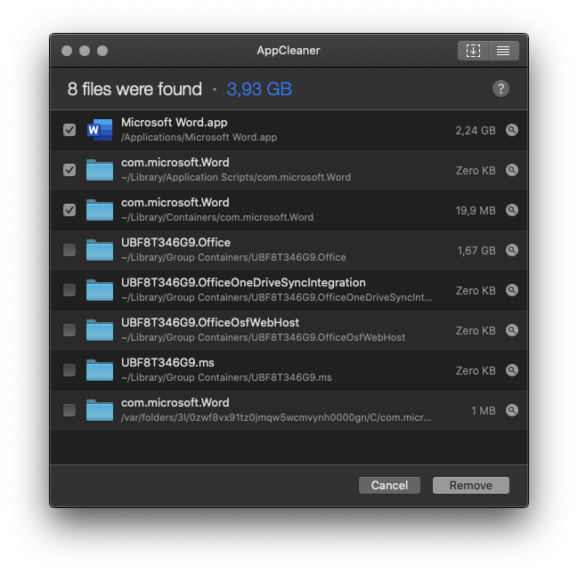
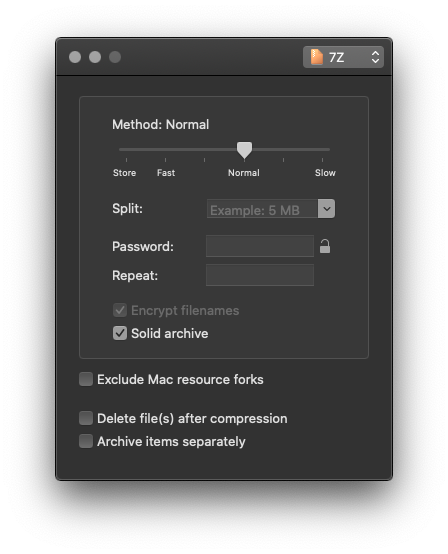

# FreeMacApps
Curated list of useful (free) Mac apps to make your life easier.

## Development

### [Sequel Pro](https://www.sequelpro.com/)
A great client for MySQL with a lot of features.

_Note: It appears that Sequel Pro currently does not support MySQL8, but you can still use it for MySQL5._

## Media Playback

### [IINA](https://iina.io/)
A modern video / music player akin to what MPlayerX was, but with way more options.

#video#audio

### [VLC](https://www.videolan.org/vlc/index.html)
The classic choice for media playback on the Mac (or any other platform for this matter).

#video#audio

### [MPV](https://github.com/mpv-player/mpv)
Another potent player for macOS and other platforms, albeit being a little unintuitive to configure.

#video#audio

## Office

## System Utilities

### [AppCleaner](http://freemacsoft.net/appcleaner/)
The perfect app to completely remove apps from macOS. Even looks through ApplicationPreferences and ApplicationSupport folders to make sure the app is _really_ gone.

 

-

### [Keka](https://www.keka.io/en/)
A free alternative to all the archivers and unarchivers. Supports all the important formats, even ISO and DMG.
 

###### Updated: 16/1/2020
